# Exercise 1 - Explore SAP Integration Suite, advanced event mesh
After completing these steps you will familiarize yourself with AEM.

## Exercise 1.1 - Log into Advanced Event Mesh and explore it

1. Log into **SAP Integration Suite, advanced event mesh**

	Link: https://eu10.console.pubsub.em.services.cloud.sap/login?tenant-id=47ad3afc-3d8a-4dca-85bb-6cce8ebae9e3

	Usermame/Password: provided by the moderator

2. Explore **SAP Integration Suite, advanced event mesh**  

	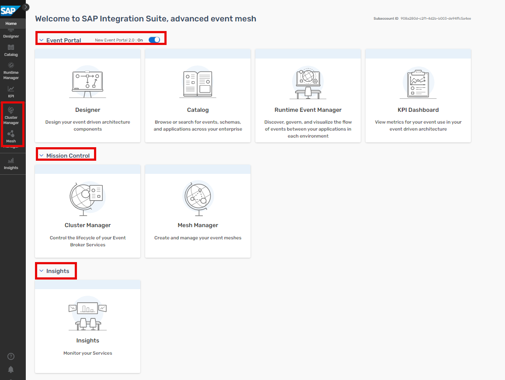

	Check out the different areas in the Advanced Event Mesh cockpit, representing the different categories of services that AEM offers:

	- **Event Portal:** Event Portal provides event management services. This subscribed service provides powerful tools to create, design, share, and manage various aspects of an EDA based on event brokers or other streaming technologies (such as Kafka).

	- **Mission Control:** Mission Control makes it easy to deploy event brokers, create event meshes, and optimize and monitor the health/performance of an event-driven system. Mission Control is a section in the Cloud Console that permits you to access event brokers, visualize and manage your event broker services, and visualize and design event meshes. Mission Control has a Cluster Manager and Mesh Manager that permits you to create event broker services and manage your event mesh.

     	- **Cluster Manager:** event broker services are made available via Cluster Manager. Each event broker service consists of event brokers configured in a High-Availability (HA) setup.

     	- **Mesh Manager:** use Mesh Manager to connect multiple event broker services that span different data centers to create an event mesh. An event mesh is an architectural layer that allows events from one application to be dynamically routed and received by any other application no matter where these applications are deployed (no cloud, private cloud, public cloud). This layer is composed by a network of event broker services. Event broker services are a modern form of messaging middleware, which are designed to move events across the distributed enterprise.

	- **Event Monitoring and Insights:** With Insights, we provide curated dashboards, easy-to-understand visualizations based on historical and real-time metrics, and timely notifications about your event broker services. This advanced information allows you to identify problems before they occur and helps you to better manage your services as your EDA scales. You can work with SAP to configure your monitoring to meet your needs. For advanced monitoring requirements, there's a single entry point to build custom visualizations to meet your organization's requirements. Coupled with visualizations is a notification email framework that alerts you when key metrics fall outside of your established thresholds. These notifications allow you to monitor what's occurring and correct developing issues before they impact or degrade your EDA. You can configure these notifications to integrate with your existing notification and logging systems.

3. Click on "**Cluster Manager**" and uncheck **"Only show my services"**. Select "**Broker Asia**".

	  

4. Click on the Button on the right and press **"Open Broker Manager"**.

	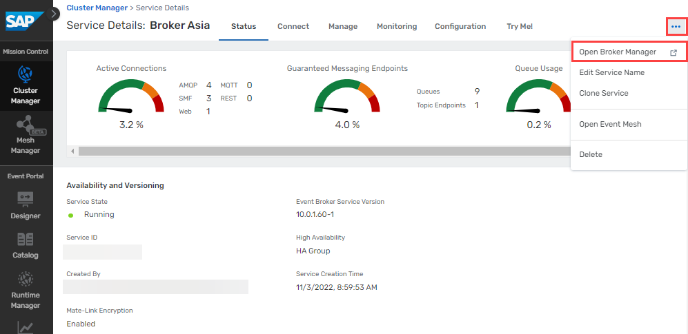  

5. Explore the **Broker Manager**

	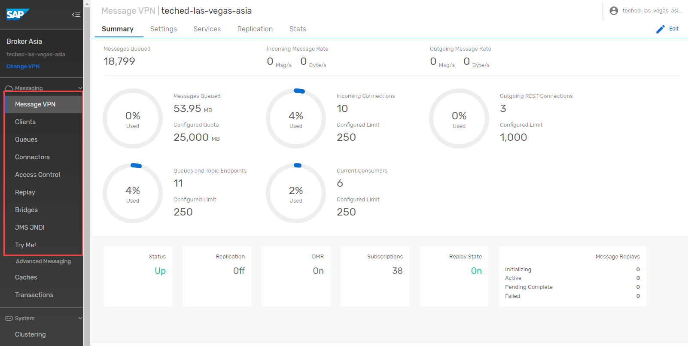  

	On the left side of the screen are the main sections to navigate through:

	- **Message VPN:** VPN-level stats and config (a Message VPN is a virtual partition of a single broker... one AEM broker can host multiple Message VPNs, and each VPN can have different authorization schemes and topic spaces; client/messaging application activity happens within the scope of a VPN)
	- **Clients:** information about connected and configured client applications
	- **Queues:** used for Guaranteed / persistent messaging
	- **Connector Wizards:** used to connect to a variety of web services
	- **Access Control:** where you create new client usernames, ACL profiles, and client profiles
	- **Replay:** where you can enable replay, to allow the broker to send previous messages again NOTE: Solace brokers do not use replay for recovery of persistent data (like Kafka)... there is a more fine-grained approach in Solace where each individual message is ACKnowledged to the broker when the consumer application is done with it
	- **Try Me!:** this is where we will connect to WebSocket test applications


## Exercise 1.2 - Create a Queue in Advanced Event Mesh

After completing these steps you will have created a queue in Advanced Event Mesh.

1. Go back to the original tab in your browser and click on **"Cluster Manager"** on the left.
2. In the All Services screen click on the **"Broker Asia"** tile.

	**HINT:** If you cannot see the tiles, uncheck the "**Only show my services**" box.

	  

3. Switch to **"Manage"** tab and click on the **"Queues"** button. A new browser tab/window will open.

	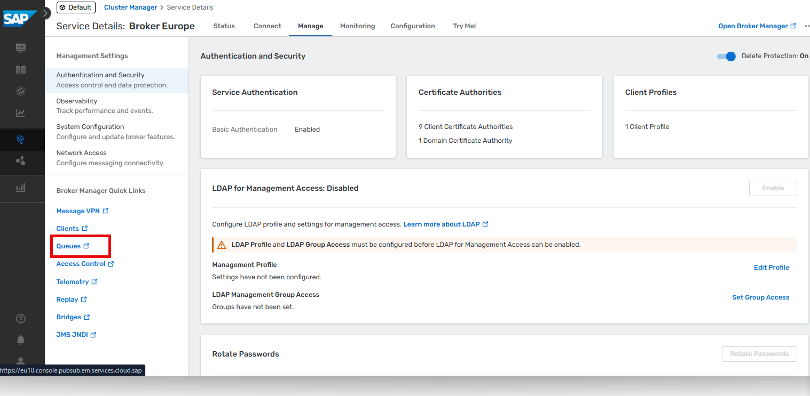     

4. Click the **"+ Queue"** button on the top right.

	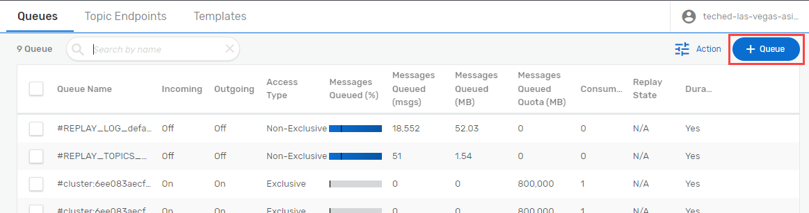        

5. In the pop up enter the queue name: **User_XXX** (replace **XXX** with your assigned user number) and click **"Create"**

	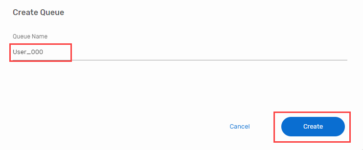      

6. On the next screen keep all the default settings and click **"Apply"**

	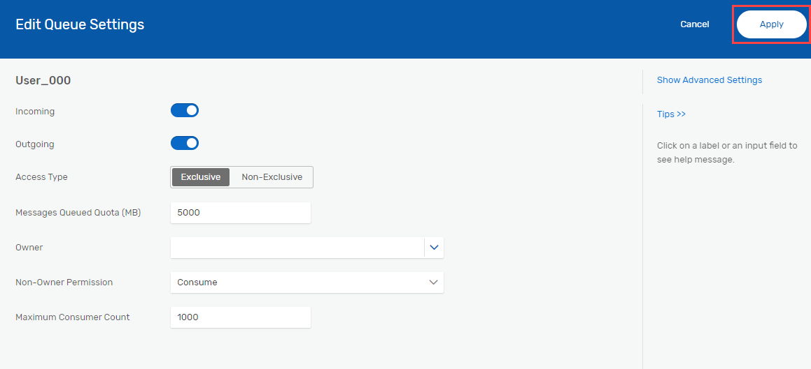       


## Exercise 1.3 - Create a Queue Subscription in Advanced Event Mesh

1. Find the queue in the list that you crated in the previous exercise and click on it.

	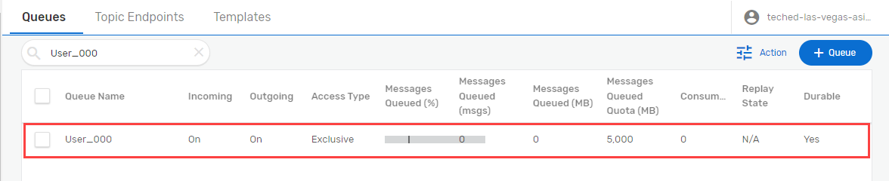  

2. Switch to the **"Subscriptions"** tab and click on **"+ Subscription"**.

	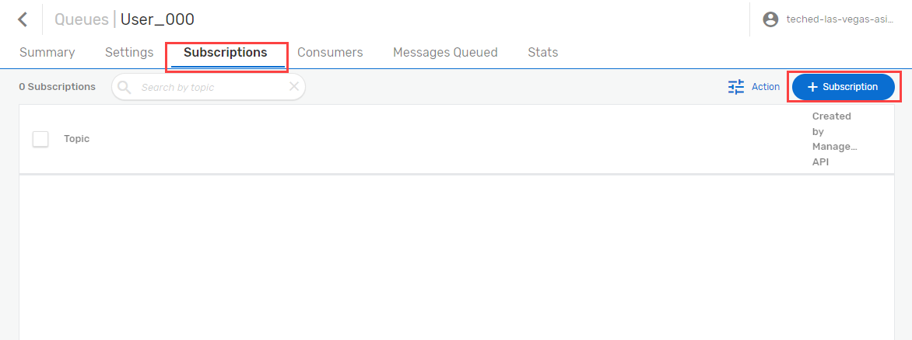  

3. Enter following topic: **userXXX/businesspartner/change**  (replace **XXX** with your assigned user number).

4. Click on **"Create"**.

	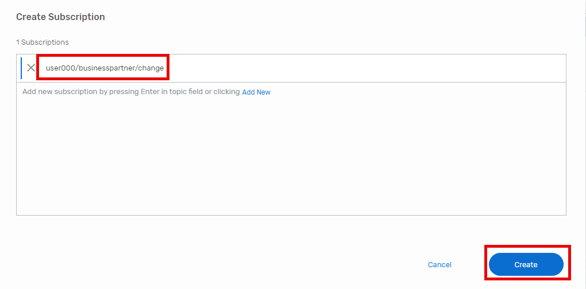  

5. Check on whether your queue subscription got created.

	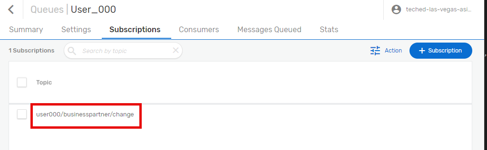  


## Exercise 1.4 - Send an event from the Try Me! tool to your Topic

1. Switch to the **"Try Me!"** Section in the menu on the left.

2. Press the **"expand" > Icon** to show the connection details. Please note, that the properties have to be adjusted else the connection will not work. We will update them in the next steps.
	
 	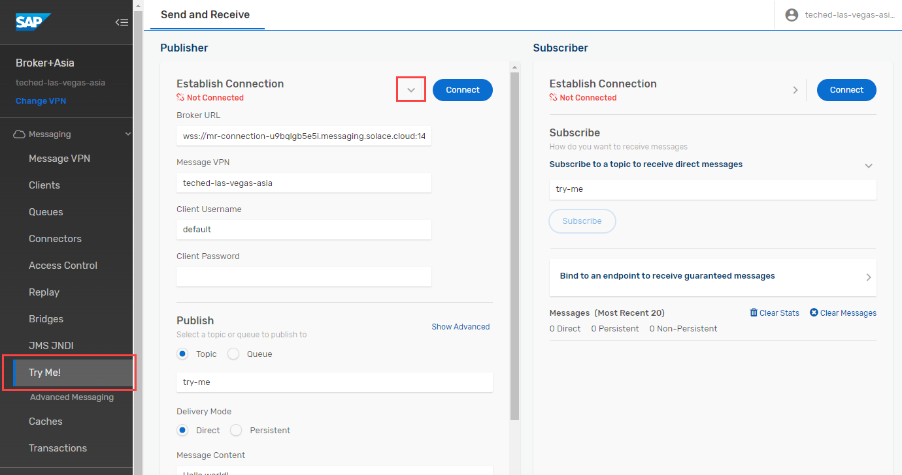 

3. Keep your current browser tab open and **go back to the other/main tab** and click on the **"Connect"** tab. Select **View by "Protocol"**.

	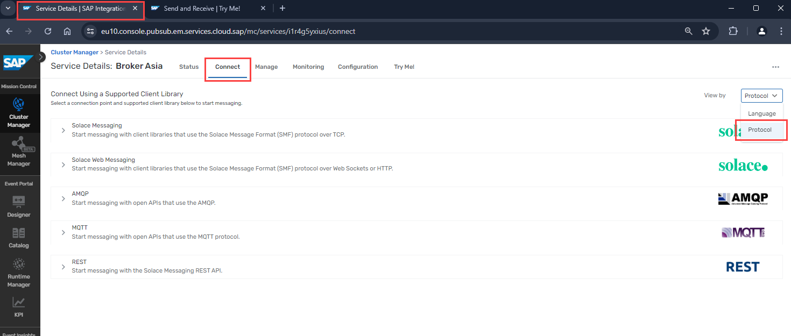 

4. Open the **"Solace Web Messaging"** entry and select **"Solace JavaScript API"**. Now the section on the right shows you the connection details.

5.  Copy these details into the relevant fields of the "**Try Me!**" opened in step 2 and overwrite the existing values.
   
	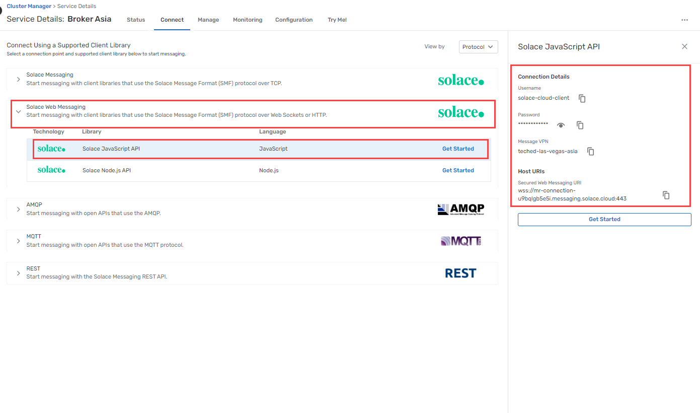 

6. Press **"Connect"** button.

	>**Important**: If your browser asks to select a certificate for authentication, press **"Cancel"** otherwise the connection will fail! If you accidentially clicked on a certificate, please restart your browser to show the dialog again.

	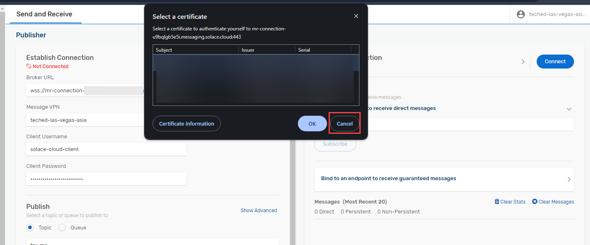  

7. Choose **"Topic"** and provide the name of the topic subscribed in step 4 of previous exercise: user**XXX**/businesspartner/change  (replace **XXX** with your user number).

8. Change "Deliver Mode" to **"Persistent** and add the following "**Message Content**":
	```json
	{
		"specversion": "1.0",
		"type": "aif.businesspartner.change",
		"source": "S4H/100",
		"datacontenttype": "application/json",
		"id": "iopoR}Qa7k{IeB7xyLljsm",
		"time": "2024-07-23T15:09:31Z",
		"data": {
			"BusinessPartner": "A10",
			"LastName": "John",
			"FirstName": "Doe",
			"Country": "DE",
			"City": "Walldorf",
			"PostCode": "69190",
			"Street": "Dietmar-Hopp-Allee",
			"HouseNumber": "16"
		}
	}
	
	```

9. Click **"Publish"** to send your message to the topic.

	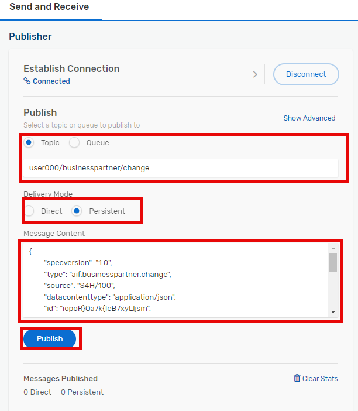  

10. You should see 1 message got published.

	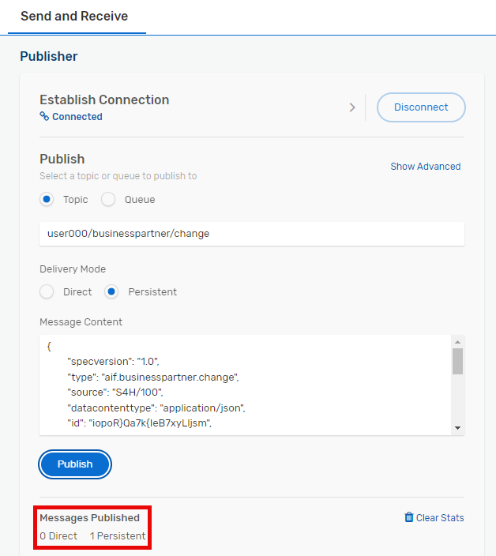  

11. Switch back to the tab **"Queues"** and click on your queue.

	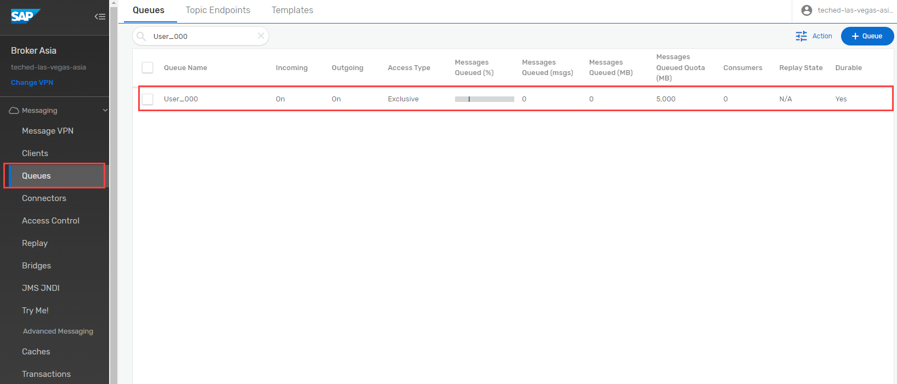  

12. You should see 1 Message got Queued.

	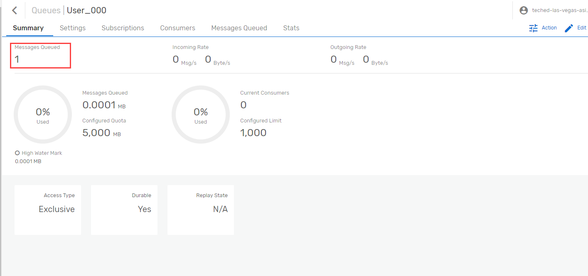  

	You have sent a message to a topic, and via the subscription this message has been persisted in your queue.

13. You can leave it like this or you can play the same game a little longer: go back to the Try Me! tool and just click publish, and see in the other tab how the count of messages gets increased (don't forget to refresh the page).

## Summary

You have now created a queue in SAP Integration Suite, advanced event mesh and have subscribed to events via a topic. You have sent events to this topic using the Try me! tool.

Please continue with [Exercise 2 - Use Cloud Integration for event mediation](../ex2/README.md)
