## Exercise 2 - Use Cloud Integration capablity for event mediation
In this exercise, an Integration Flow is added as a consumer via the Advanced Event Mesh adapter using the Solace Messaging Format (SMF). Integration flows can be used to mediate events, such as mapping of event structures and data, enriching event payloads (for example, catching a narrow business notification event and calling back to the event publisher to enrich with more data)

## Exercise 2.1 - Setup REST Endpoint

Before we start building our integration flow, we will "provision" a simple HTTP endpoint where we will send the message.

1. ### Webhook.site (HTTP endpoint)

    For simplicity purposes, our REST consumer will be a simple HTTP endpoint that will receive the messages from the queue. We will use a tool called [Webhook.site](https://webhook.site/) to create a temporary endpoint that will receive the messages. When you navigate to the website, you will be presented with a unique URL that you can use to receive the messages. **Take note of the unique URL** as we will use it to configure the REST consumer.
    
    

        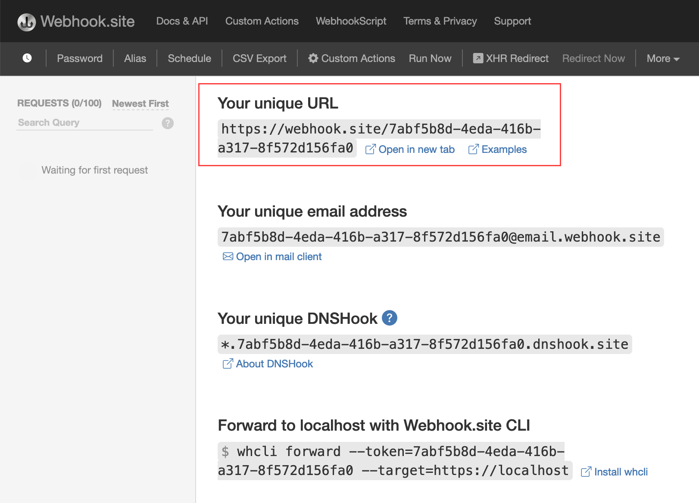 
        <i>webhook.site example</i>
    

## Exercise 2.2 - Create Integration Package in Cloud Integration capability of SAP Integration Suite

1. Open the SAP Integration Suite landing page via this [link](https://cpisuite-europe-03.integrationsuite.cfapps.eu20-001.hana.ondemand.com/shell/home).

   

2. Navigate to **Design > Integrations and APIs**, and select **Create**.

   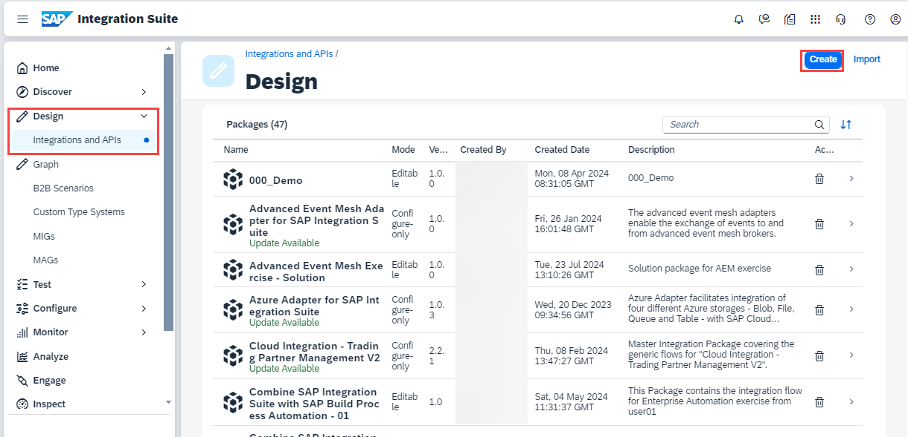
   
3. Fill the following:
    **Name:** "User**XXX**" where **XXX** is your assigned user number
    **Short Description:** "Integration Package for event mediation from User **XXX**".

    click **Save**.

   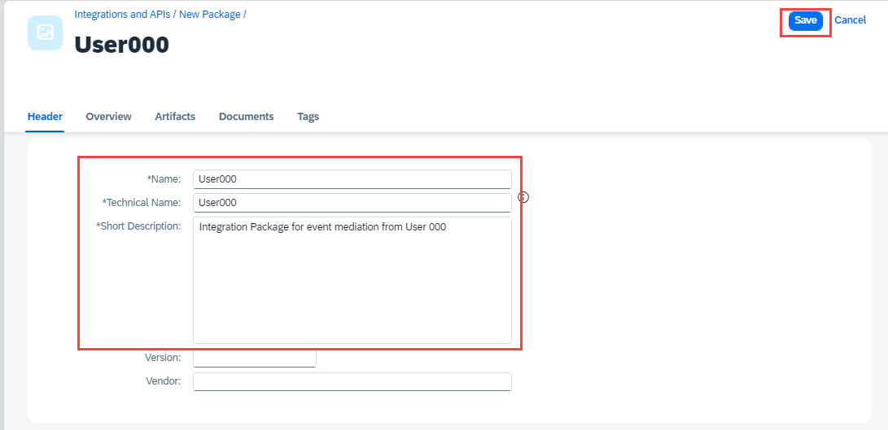

## Exercise 2.3 - Copy & Configure the Subscriber Integration Flow

1. Navigate to **Design > Integrations and APIs**.

2. Seach for the package "**Advanced Event Mesh Exercise - Solution**" and select it.

   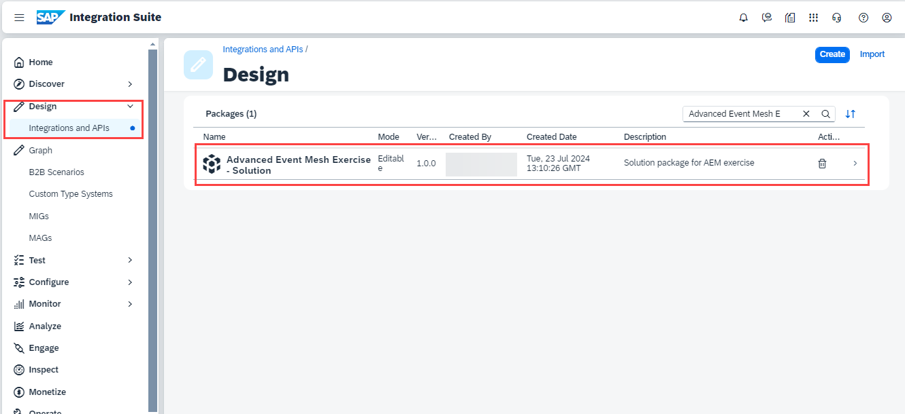

3. Navigate to the **"Artifacts"** tab select the **"Action"** button and click **"Copy"**

   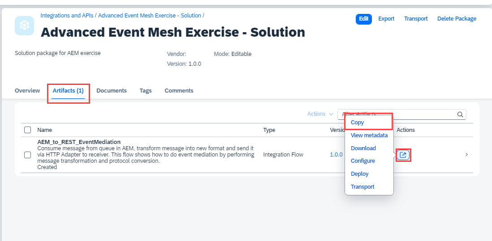

4. Change the name to **AEM_to_REST_EventMediation_UserXXX** and replace **XXX** with your assigned user number. Press the **"Select"** button to select the package.

   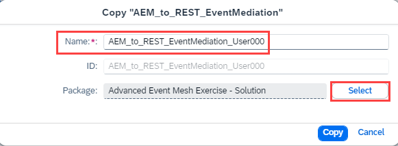

5. Select the package you created in Exercise 2.2.

   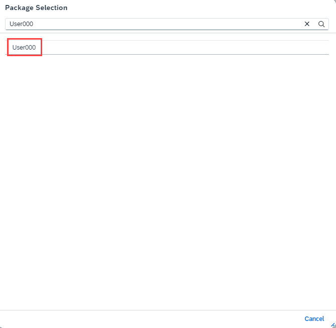

6. Press **"Copy"** button

   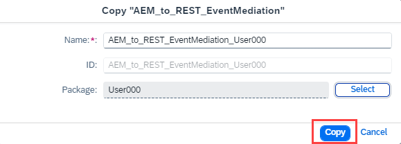

7. Press **Navigate** to go directly to the copied package.
 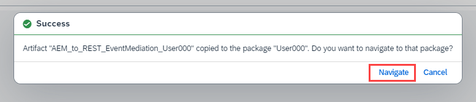

8. Click on the copied integration flow to open it.
   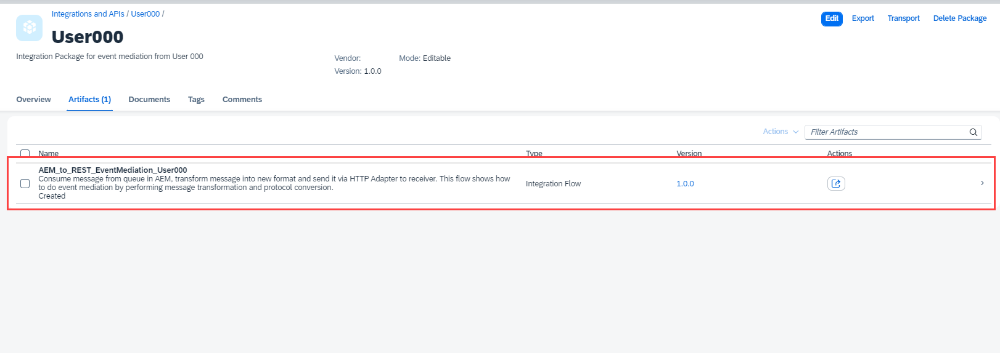

9. The integration flow will subscribe to your queue and performs a call back to the event publisher to enrich with more data (Mock API Call). The result is sent to the HTTP reciever endpoint that you created in Exercise 2.1. Press **Configure** to set the required properties.

    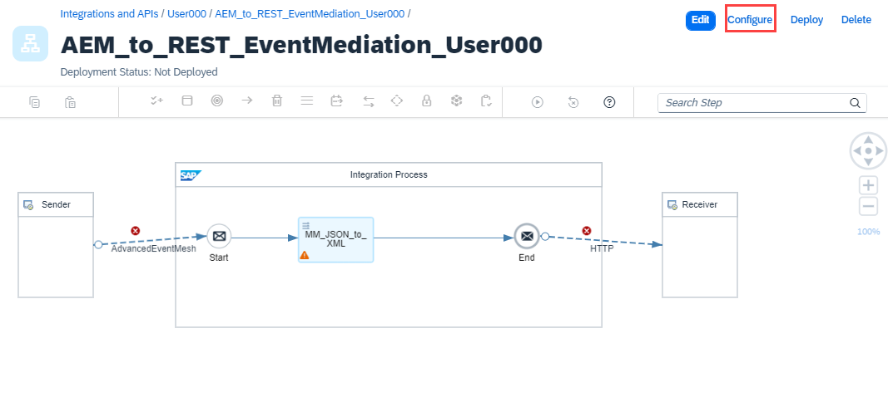

10. Provide the name of your AEM queue that you created in Exercise 1: **User_XXX** (replace **XXX** with your assigned user number).

    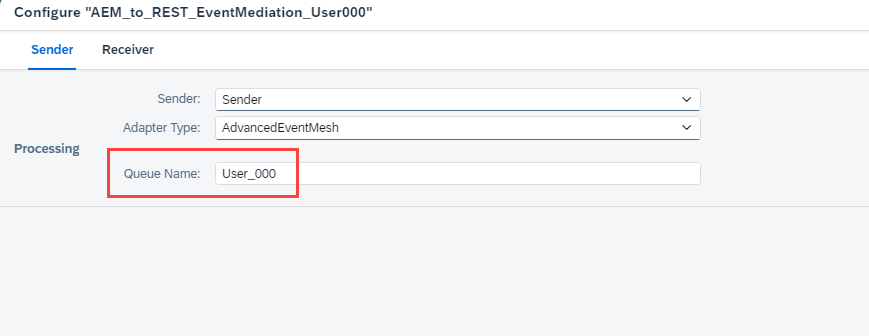

11. Switch to the **"Receiver"** tab and provide your unique webhook URL you created in Exercise 2.1 and click on **"Save"** button.

    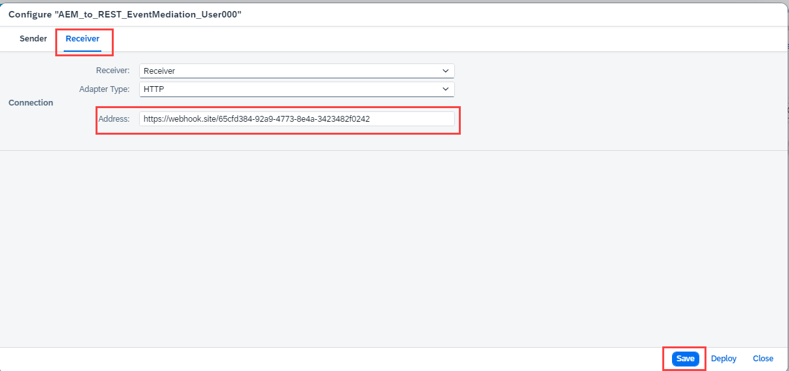

12. **Close** the warning message.

    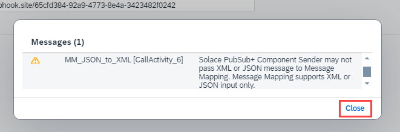

13. Press **"Deploy"** to deploy your integration flow.

    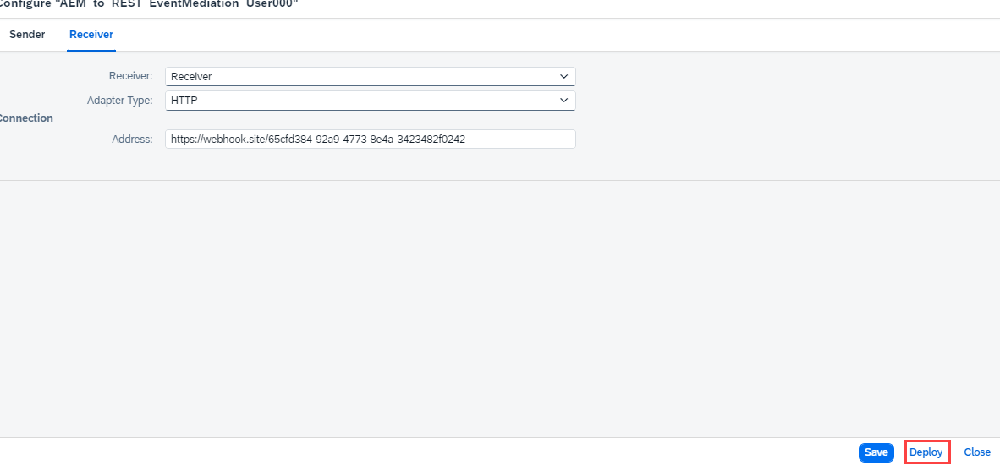

14. Select Runtime Profile **"Cloud Integration"** and press **"Yes"**. Press **"Ok**" to close the dialog.

    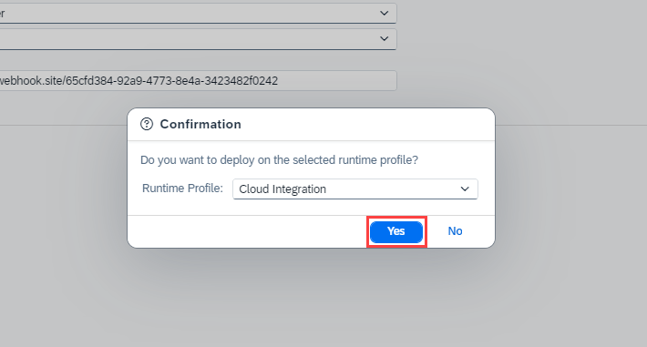

## Exercise 2.4. Monitor Consumed Messages
1. Navigate to "**Monitor-> Integrations and APIs**". Open the **"Manage Integration Content"** tile.

    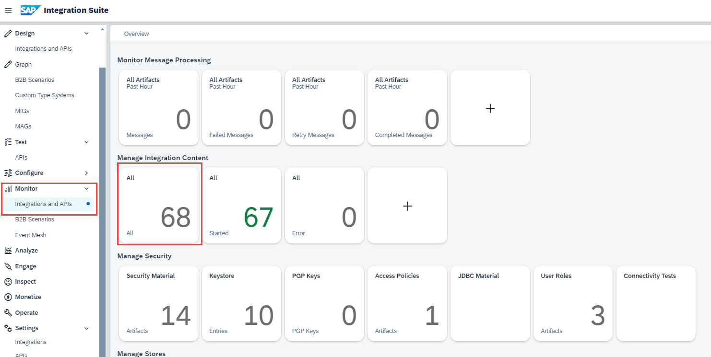

2. Search for your integration flow. It should be in **"Started"** status. Press **"Monitor Message Processing"** to view the processed Messages.

    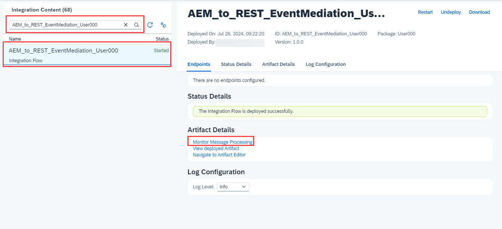

3. You should see at least one Messages in the list with Status **"Completed"**.

   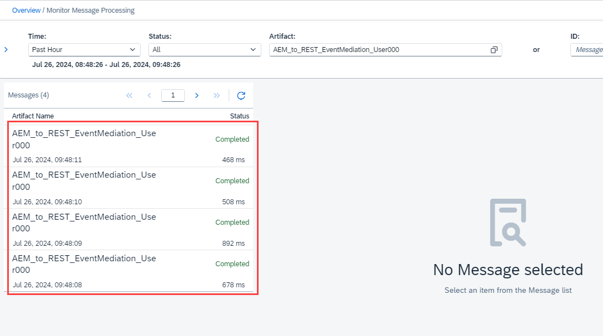

4. Open the webhook site created in Exercise 2.1. Here you should the messages sent from Cloud Integration. Notice the enriched payload by the integration flow callback to the event publisher.

   

Please continue with [Exercise 3](../ex3/README.md)
