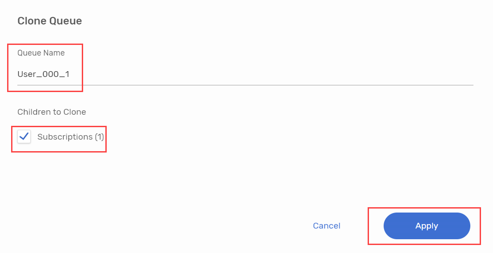
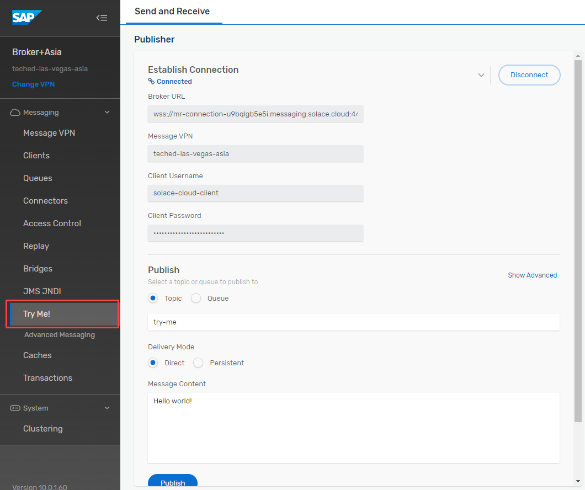

## Exercise 3: Incremental growth: Add web application as additional consumer


The publish-subscribe pattern decouples the sending and receiving applications. This makes it easy to add new applications allows for incremental growth. In this exercise a web application is added as additional consumer. The web application is subscribed to a queue and lists all business partners.

## Exercise 3.1: Create new queue for additional application

1. Go back to the original tab in your browser and click on **"Cluster Manager"** on the left.
2. In the All Services screen click on the **"Broker Asia"** tile.

> **_HINT:_** If you cannot see the tiles, uncheck the "Only show my services" box.

  


3. Switch to **"Manage"** tab and click on the **"Queues""** tile. A new window opens up.


4. Search for the queue you created in exercise 1.2: User_**XXX** (replace **XXX** with your user number).
5. Select the checkbox on the left and press "**Action**" -> "**Clone**"


6. Change the "Queue Name" to: **User_XXX_WebApp** (replace **XXX** with your user number). Select the checkbox to cole the subscription. Press "**Apply**".



## Exercise 3.2: Configure Web Application
In this exercise you will conifugre the Business Partner Web Application. On this Website you will subscribe to the queue creatd in exercise 3.1 via your web browser. Every business partner published to your queue will be shown on the website.


1. Open the [Business Partner Web Applicaiton](https://sap-cpisuite-europe-01n-cpisuite-europe-01-aem-demo-client.cfapps.eu10.hana.ondemand.com/app/index.html#/businessPartner).

2. Provide the same connection details as captured in [Exercise 1.4 - Send an event from the Try Me! Tool to your Topic](../ex1#exercise-14---send-an-event-from-the-try-me-tool-to-your-topic)

3. Change Subscription Type to **"Queue"** an fill in the queue name created in exercise 3.1: **User_XXX_WebApp** (replace **XXX** with your user number). Press **"Connect"**.
> **_HINT:_** If your broswer is asking to use a certificate for authentication, press "Do not send certificate".
> 
> 


5. The Pop-Up should close and status shows **"Connected"**. Now your browser is directly subscribed to the queue and ready to receive business partner events.


## Exercise 3.3: Publish event to topic

In exercise 1, we did publish event to a queue. This time the event will be published to a topic instead. All queues subscribed to the topic will receive the event. This means both of your queues will receive events from all participants.

1. Switch back to the Broker Instance and open the **"Try me tool"**.  If your Broker is not connected, plese repeat the steps 14-19 of exercise 1.4 [Exercise 1.4 - Send an event from the Try Me! Tool to your Topic](../ex1#exercise-14---send-an-event-from-the-try-me-tool-to-your-topic)



2. Change to publish to a **"Topic"** and provide  user**XXX**/businesspartner/change  (replace **XXX** with your user number) as value.
3. For the message content change the **"BusinessPartner"** value UserXXX to your User ID, e.g. **"User000"**. Press "**Publish**""
```json
{
	"specversion": "1.0",
	"type": "aif.businesspartner.change",
	"source": "S4H/100",
	"datacontenttype": "application/json",
	"id": "iopoR}Qa7k{IeB7xyLljsm",
	"time": "2024-07-23T15:09:31Z",
	"data": {
		"BusinessPartner": "UserXXX",
		"LastName": "John",
		"FirstName": "Doe",
		"Country": "DE",
		"City": "Walldorf",
		"PostCode": "69190",
		"Street": "Dietmar-Hopp-Allee",
		"HouseNumber": "16"
	}
}
```


4. You should see your entry in the application. Be aware that if you send a business partner with the same ID, an update of the existing entry will be triggered instead of creating a new entry.


5. As you published the event to a topic, all queues subscribed have received the event. This means also the integration flow in exercise 2 is executed again and you should see an corresponding entry in the webhook site.

**Congratulations, you completed all exercises!**

